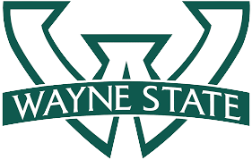

Education
===
---

  

    

      

         
      <!-- horizon logo -->
      

    

    

      

        <b><a href="https://wayne.edu">Wayne State University</a></b> 
        <b>Aug. 2023 - Present</b> 
        <b>PhD in Computer Engineering</b> | <a href="https://engineering.wayne.edu/electrical-computer">Dept. of Electrical and Computer Engineering</a> 
        Physics-AI | Cyber-Physical Systems | Autonomous Vehicles | AI Safety | Robotics
      

    

  

  

    

      

         
      <!-- horizon logo -->
      

    

    

      

        <b><a href="https://www.wpi.edu">Worcester Polytechnic Institute</a></b> 
        <b>Aug. 2021 - May. 2023</b> 
        <b>Master of Science in Robotics Engineering</b> | <a href="https://www.wpi.edu/academics/departments/robotics-engineering">Dept. of Robotics Engineering</a> 
        Robot Control | 3D Perception | Human Robot Callobration | Computer Security
      

    

  

  

    

      

         
      <!-- horizon logo -->
      

    

    

      

        <b><a href="https://www.njupt.edu.cn/en">Nanjing University of Posts and Telecommunications</a></b> 
        <b>Sep. 2016 - Jun. 2020</b> 
        <b>Bachelor of Science in Telecommunications Engineering</b> | <a href="https://bhs.njupt.edu.cn/wwwwwww/list.htm">Bell Honor School</a> 
        Electromagnetism | Signal Processing | Circuits Design | Embedded System 
         
      

    

  

Research
===
---

  

    

       
    <!-- horizon logo -->
    

  

  

    

      <b><a href="https://www.tum.de/en/">Technical University of Munich</a></b> 
      <b>Sep. 2023 - Present</b> 
      <b>Incoming Visiting Schalor</b> | <a href="https://rtsl.cps.mw.tum.de/">Chair of Cyber-Physical Systems in Production Engineering</a> 
      Quadruped Robot | Deep Reinforcement Learning | Robot Vision | Safety & Time-Critical CPS
    

  

  

    

       
    <!-- horizon logo -->
    

  

  

    

      <b><a href="https://www.stanford.edu">Stanford University</a></b> 
      <b>Jan. 2018 - Feb. 2018</b> 
      <b>Visiting Student</b> | <a href="https://ee.stanford.edu">Dept. of Electrical Engineering</a> | <a href="https://ai.stanford.edu">SAIL Lab</a> 
      Machine Learning | Artifical Intelligence | Radio Frequency Identification (RFID)  
    

  

Industry
===
---

  

    

       
    <!-- horizon logo -->
    

  

  

    

      <b><a href="https://global.abb/group/en">ABB Inc</a></b> 
      <b>Jan. 2023 - May. 2023</b><!-- | San Jose, CA, USA --> 
      <b>R&D Engineer (Internship)</b> | <a href="https://new.abb.com/about/our-businesses/robotics-and-discrete-automation">Dept. of Robotics & Discrete Automation</a> 
      Pick-and-Place | Deep Learning | 3D Semantic Instance Segmentation | Model Optimization
    

  

  

    

       
    <!-- horizon logo -->
    

  

  

    

      <b><a href="https://www.hillstonenet.com">Hillstone Networks</a></b> 
      <b>Apr. 2021 - Aug. 2021</b><!-- | Beijing, China --> 
      <b>Software Engineer (Full Time)</b> | <a href="https://www.hillstonenet.com/products/cloud-protection">Dept. of Cloud Security (Cloud Armour)</a> 
      Cloud Computing | Container Runtime Security | Safety Critical OS | Penetration Testing
    

  

  

     
    <!-- horizon logo -->
  

  

    

      <b><a href="https://online.iwhalecloud.com/">Whale Cloud Technology</a></b> 
      <b>Jul. 2020 - Mar. 2021</b><!-- | Nanjing, Jiangsu, China --> 
      <b>DevOps Engineer (Full Time)</b> | <a href="https://online.iwhalecloud.com/DigitalBSS">Dept. of Internation Delivery Center (Digital BSS)</a> 
      Product Delivery | CI/CD | SaaS Platform | Network Flow Analysis | Database Management  
    

  

Honors & Awards
===
---
<ul style="font-size: {{ page.font_size }};"> 
  <li> 
    <b>Tau Beta Pi Honor Society Candidate</b>, Award by WPI Massachusetts Alpha Chapter <b> 2022 </b> 
  </li> 
    <li> 
    <b>Robotics Engineering Honor Society Member</b>, Award by Rho Beta Epsilon WPI <b> 2022 </b> 
  </li> 
  <li> 
    <b>First Prize</b>, Award in National University Smart Connected Innovation Competition <b> 2018 </b> 
  </li> 
  <li>
    <b>Third Prize</b>, Award in National University Mathematical Contest in Modelling <b> 2018 </b> 
  </li> 
  <li>
    <b>Third Prize</b>, Award in 2018 China National University Service Robot Competition <b> 2018 </b> 
  </li>
  <li>
    <b>Second Prize</b>, Award in Institutional Science & Technology Innovation Contest<b> 2017 </b> 
  </li> 
  <li>
    <b>First Prize</b>, Award in Provincial University Advanced Mathematics Contest<b> 2017 </b> 
  </li> 
  <li>
    <b>Academic & Civilian Scholarship</b>, Award by Bell Honor School Faculty Honors <b> 2016, 2017 </b> 
  </li> 
</ul>